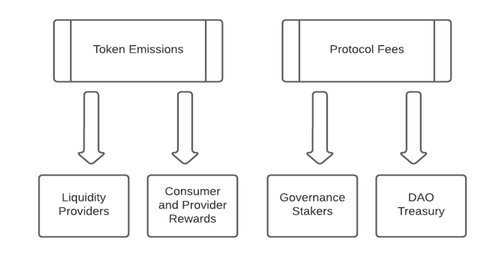

# Emissions and Distributions

Coming soon...

There are two types of rewards generated by the protocol:

**CASK Token Emissions** - For the first 5 years after token launch, the protocol will emit CASK tokens from the rewards token allocation.
After the 5 years, the protocol will transition to using income to buy back CASK from the open market. These CASK tokens
will be distributed as rewards to protocol balance holders as well as used for liquidity incentives to ensure an active
market for service providers to acquire CASK tokens, via either liquidity mining campaigns or bribe mechanisms. The
split of emissions between the various parties is governed by the DAO.

**Protocol Fees** - The fees generated by the protocol are distributed to both CASK governance stakers and the DAO treasury. 